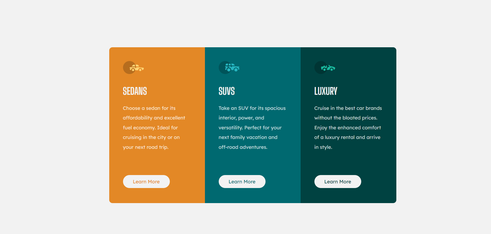

# Frontend Mentor - 3-column preview card component solution

This is a solution to the [3-column preview card component challenge on Frontend Mentor](https://www.frontendmentor.io/challenges/3column-preview-card-component-pH92eAR2-). Frontend Mentor challenges help you improve your coding skills by building realistic projects. 

## Table of contents

- [Overview](#overview)
  - [The challenge](#the-challenge)
  - [Screenshot](#screenshot)
  - [Built with](#built-with)
- [Author](#author)

## Overview

## The challenge

Users should be able to:

- View the optimal layout depending on their device's screen size
- See hover states for interactive elements

### Screenshot

- Solution URL: https://www.frontendmentor.io/solutions/3columnpreviewcardcomponent-SEPHqkG6A
- Live Site URL: https://trinityjayd.github.io/FrontEnd-Mentor-3-column-preview-card-component/

### Built with

- Semantic HTML5 markup
- CSS custom properties

## Author

- Website - [Trinity Tiratram](https://trinityjayd.github.io/)
- Frontend Mentor - [@TrinityJayd](https://www.frontendmentor.io/profile/TrinityJayd)
- Twitter - [@trinity_jayd](https://twitter.com/trinity_jayd)
